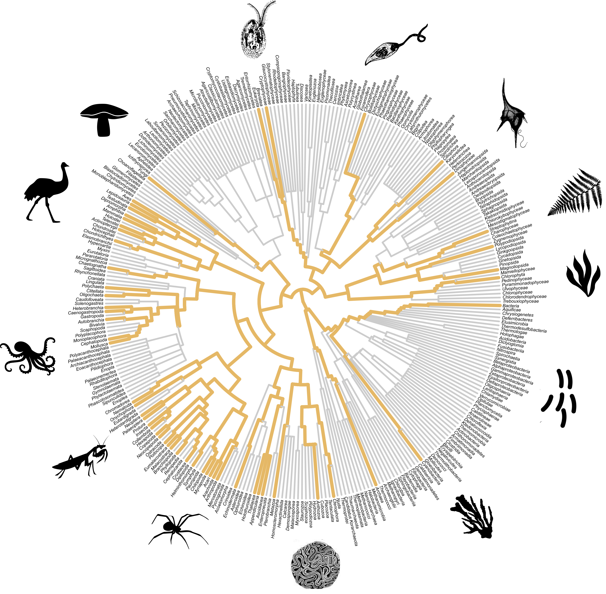

<!-- README.md is generated from README.Rmd. Please edit that file -->

<!-- badges: start -->
<!-- badges: end -->


```{r setup, include=FALSE}
knitr::opts_chunk$set(echo = TRUE)
```

#### Tree topology of taxa within multiple taxa research in functional ecology (orange branches). 
##### We assessed the coverage of the reviewed research across the Tree of Life using the classification of Ruggiero et al. (2015) to all organisms on Earth. The phylogeny was based on the taxonomic ranks of studied organisms. Taxonomic nomenclature follows the NCBI (National Center for Biotechnology Information), and is above Subclass level. As some studies have identified varying taxonomic levels for the same organism (e.g., Acari, Arachnida), we have opted to display all taxonomic ranks instead of solely showcasing the higher-level rank as the phylogeny's edges. Silhouettes were obtained from Google images. 

```{r echo=FALSE, out.width = "100%",out.height = "80%", fig.align = "center"}

```


#### This paper was produced using the following software and associated packages:

```{r pressure, echo=F,warning=F,message=F}

source("R/packages.R")
sessionInfo()


```

